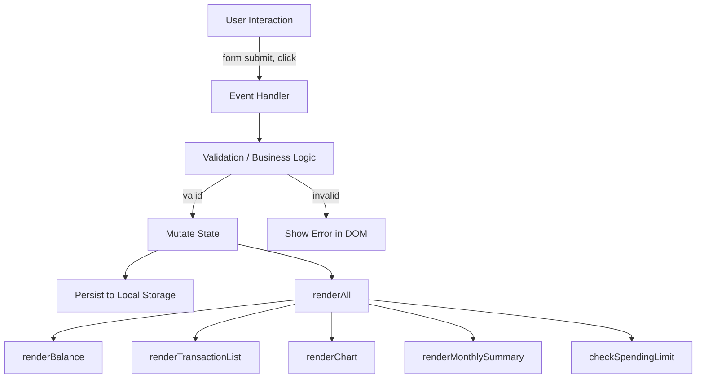

# Design Document — Expense & Budget Visualizer

## Overview

Expense & Budget Visualizer adalah aplikasi web single-page (SPA) yang berjalan sepenuhnya di browser tanpa backend, build tool, atau package manager. Aplikasi ini memungkinkan pengguna mencatat pengeluaran harian, memvisualisasikannya dalam grafik donat, menetapkan batas anggaran, serta menganalisis tren bulanan.

**Technology stack:**
- **HTML5** — struktur dokumen tunggal (`index.html`)
- **CSS3** — satu file stylesheet (`css/style.css`) dengan CSS custom properties untuk theming
- **Vanilla JavaScript (ES2020+)** — satu modul (`js/app.js`) yang mengelola state, DOM, dan logika bisnis
- **Chart.js 4.4.3** — dimuat via CDN untuk rendering grafik donat
- **Browser Local Storage API** — persisten data antar sesi tanpa server

**Scope fitur:**
1. Input transaksi dengan validasi form (nama, jumlah, kategori)
2. Daftar transaksi dengan hapus dan sort
3. Ringkasan saldo (total, count, jumlah kategori)
4. Grafik donat pengeluaran per kategori (Chart.js)
5. Persisten data via Local Storage
6. Dark/light mode toggle *(optional feature 2)*
7. Pengurutan transaksi *(optional feature 3)*
8. Highlight batas pengeluaran *(optional feature 4)*
9. Kategori kustom *(optional feature 1)*
10. Ringkasan bulanan dengan navigasi bulan *(optional feature 5)*

---

## Architecture

Aplikasi mengikuti pola **single-module MVC sederhana** tanpa framework:

```
┌─────────────────────────────────────────────────────┐
│                     Browser                          │
│                                                     │
│  ┌────────────┐    ┌──────────────┐    ┌─────────┐  │
│  │  index.html│    │  app.js      │    │ Chart.js│  │
│  │  (View)    │◄───│  (Controller │    │  (CDN)  │  │
│  │            │    │   + Model)   │───►│         │  │
│  └─────┬──────┘    └──────┬───────┘    └─────────┘  │
│        │                  │                         │
│        └──────────────────▼──────────────────────── │
│                   ┌──────────────┐                  │
│                   │ Local Storage│                  │
│                   │  (Persistence│                  │
│                   │   Layer)     │                  │
│                   └──────────────┘                  │
└─────────────────────────────────────────────────────┘
```

**Alur data utama:**



**Prinsip desain:**

| Prinsip | Implementasi |
|---|---|
| Single source of truth | State `transactions[]`, `customCategories[]`, `spendingLimit`, `currentTheme` hidup di memory |
| Immutable storage writes | Setiap mutasi state langsung diikuti `saveTransactions()` |
| Re-render from scratch | Setiap perubahan state memanggil `renderAll()` yang merender ulang seluruh UI |
| No DOM diffing | DOM ditulis ulang setiap render (jumlah data kecil, performansi cukup) |
| XSS prevention | Semua string user-generated di-escape dengan `escapeHtml()` sebelum masuk innerHTML |

---

## Components and Interfaces

### Komponen UI

```
app-header
  ├── header-title (ikon + judul)
  └── #themeToggle (btn-icon)

app-main
  ├── .balance-card
  │     ├── #totalBalance
  │     ├── #totalTransactions
  │     └── #totalCategories
  │
  ├── #limitBanner (alert, hidden by default)
  │
  ├── .content-grid
  │     ├── .col-left
  │     │     ├── #transactionForm
  │     │     │     ├── #itemName (text input)
  │     │     │     ├── #amount (number input)
  │     │     │     ├── #category (select + __custom__ option)
  │     │     │     └── #customCategoryGroup (hidden until __custom__ selected)
  │     │     │
  │     │     ├── .spending-limit-card
  │     │     │     ├── #spendingLimit (number input)
  │     │     │     ├── #setLimitBtn
  │     │     │     └── #limitInfo
  │     │     │
  │     │     └── .chart-card
  │     │           ├── #expenseChart (canvas)
  │     │           └── #chartEmpty (text, hidden when data exists)
  │     │
  │     └── .col-right
  │           ├── .monthly-summary-card
  │           │     ├── #prevMonth / #nextMonth
  │           │     ├── #monthLabel
  │           │     └── #monthlySummary
  │           │
  │           └── .transaction-list-card
  │                 ├── #sortSelect
  │                 ├── #clearAllBtn
  │                 └── #transactionList
  │                       └── .transaction-item (×N)

app-footer
```

### JavaScript Module Interfaces

Semua fungsi berada dalam satu file `app.js` dengan struktur berikut:

#### Persistence Layer

```javascript
// Menyimpan/memuat transactions ke/dari localStorage
function saveTransactions(): void
function loadTransactions(): void   // populates `transactions[]`

// Menyimpan/memuat theme
function saveTheme(): void
function loadTheme(): void          // populates `currentTheme`

// Menyimpan/memuat spending limit
function saveLimit(): void
function loadLimit(): void          // populates `spendingLimit`

// Menyimpan/memuat custom categories
function saveCategories(): void
function loadCategories(): void     // populates `customCategories[]`
```

#### Utility Functions

```javascript
// Format angka ke string Rupiah: "Rp 25.000"
function formatRp(amount: number): string

// Format ISO date string ke "12 Jan 2025"
function formatDate(isoString: string): string

// Generate ID unik berbasis timestamp + random
function generateId(): string

// Kembalikan CSS class slug untuk category ("food", "transport", "fun", "custom")
function getCategorySlug(cat: string): string

// Kembalikan emoji icon untuk category
function getCategoryIcon(cat: string): string

// Kembalikan warna hex deterministik untuk category
// Built-in: hardcoded. Custom: hash(name) % EXTRA_COLORS.length
function getCategoryColor(cat: string): string

// Escape HTML entities untuk mencegah XSS
function escapeHtml(str: string): string

// Kembalikan semua kategori (default + custom) sebagai array of {value, label, icon}
function getAllCategories(): Category[]
```

#### Rendering Functions

```javascript
// Render balance card (total, count, unique categories)
function renderBalance(): void

// Render daftar transaksi berdasarkan sort mode aktif
function renderTransactionList(): void

// Render/update Chart.js doughnut chart
function renderChart(): void

// Render monthly summary untuk bulan aktif (monthOffset)
function renderMonthlySummary(): void

// Cek dan tampilkan/sembunyikan spending limit banner
function checkSpendingLimit(): void

// Render UI spending limit (pre-fill input jika ada limit tersimpan)
function renderLimitUI(): void

// Master render: memanggil semua render functions di atas
function renderAll(): void
```

#### Business Logic

```javascript
// Validasi semua field form; menampilkan error per field; return true jika valid
function validateForm(): boolean

// Kembalikan salinan transactions[] yang diurutkan sesuai sortSelect.value
function getSortedTransactions(): Transaction[]

// Hapus satu transaction berdasarkan id
function deleteTransaction(id: string): void

// Kembalikan Date object untuk bulan yang sedang dilihat
function getViewedMonth(): Date

// Terapkan theme ke DOM dan update Chart.js text color jika perlu
function applyTheme(theme: 'light' | 'dark'): void

// Rebuild dropdown kategori (default + custom + __custom__ option)
function rebuildCategorySelect(): void

// Inisialisasi aplikasi: load all state, apply theme, render UI
function init(): void
```

---

## Data Models

### Transaction

Satu entri pengeluaran yang disimpan sebagai elemen dalam array `transactions`.

```typescript
interface Transaction {
  id:        string;   // generateId(): timestamp+random, e.g. "lc5x2a9k3"
  name:      string;   // nama item, 1–60 karakter, sudah di-trim
  amount:    number;   // jumlah dalam Rupiah, harus > 0
  category:  string;   // nama kategori (default atau kustom), e.g. "Food", "Gym"
  createdAt: string;   // ISO 8601 string, e.g. "2025-01-15T09:30:00.000Z"
}
```

**Contoh:**
```json
{
  "id": "lc5x2a9k3",
  "name": "Makan Siang",
  "amount": 35000,
  "category": "Food",
  "createdAt": "2025-07-14T07:22:15.123Z"
}
```

### Category

Objek yang merepresentasikan pilihan kategori dalam dropdown form.

```typescript
interface Category {
  value: string;   // key yang disimpan di Transaction.category
  label: string;   // teks yang ditampilkan di dropdown, termasuk emoji
  icon:  string;   // emoji icon untuk tx-icon dan tx-badge
}
```

**Kategori bawaan:**
```json
[
  { "value": "Food",      "label": "🍔 Food",      "icon": "🍔" },
  { "value": "Transport", "label": "🚌 Transport",  "icon": "🚌" },
  { "value": "Fun",       "label": "🎮 Fun",        "icon": "🎮" }
]
```

### Application State

State global yang hidup di memory selama sesi browser aktif.

```typescript
// Array semua transaksi yang tersimpan
let transactions: Transaction[] = [];

// Nama-nama kategori kustom (bukan objects, hanya string)
let customCategories: string[] = [];

// Batas pengeluaran dalam Rupiah; null berarti tidak ada limit
let spendingLimit: number | null = null;

// Theme aktif saat ini
let currentTheme: 'light' | 'dark' = 'light';

// Offset bulan dari bulan saat ini (0 = bulan ini, -1 = bulan lalu, dll.)
let monthOffset: number = 0;

// Referensi instance Chart.js; null sebelum chart pertama dibuat
let chartInstance: Chart | null = null;
```

### Local Storage Schema

| Key | Type | Description |
|---|---|---|
| `ebv_transactions` | `Transaction[]` (JSON) | Array semua transaksi |
| `ebv_theme` | `'light' \| 'dark'` (string) | Preferensi tema |
| `ebv_limit` | number string atau `''` | Nilai spending limit; string kosong jika belum diset |
| `ebv_categories` | `string[]` (JSON) | Daftar nama kategori kustom |

**Strategi error handling untuk Local Storage:**
- Semua operasi `JSON.parse` dibungkus `try/catch`
- Jika parse gagal → state direset ke nilai default (array kosong / null)
- Error tidak ditampilkan ke pengguna (silent fallback per Req 5.4)

### Chart Data Shape

Data yang dikirim ke Chart.js dikomputasi dari `transactions[]` saat `renderChart()` dipanggil:

```typescript
interface ChartData {
  labels:   string[];   // nama kategori
  datasets: [{
    data:            number[];  // total amount per kategori
    backgroundColor: string[];  // warna hex per kategori
    borderWidth:     number;
    borderColor:     string;
    hoverOffset:     number;
  }]
}
```

---

## Correctness Properties

*A property is a characteristic or behavior that should hold true across all valid executions of a system — essentially, a formal statement about what the system should do. Properties serve as the bridge between human-readable specifications and machine-verifiable correctness guarantees.*

### Property 1: Transaction storage round-trip

*For any* array of valid transactions, serializing the array to Local Storage with `saveTransactions()` and then loading it back with `loadTransactions()` should produce an array with the same length and identical field values for every transaction.

**Validates: Requirements 1.4, 5.1, 5.2, 5.3**

---

### Property 2: Form validation rejects invalid inputs

*For any* combination of form inputs where at least one of the following is true — (a) `name` is blank or whitespace-only, (b) `amount` is zero, negative, or non-numeric, (c) `category` is not selected — `validateForm()` should return `false` and set a non-empty error message for each invalid field.

**Validates: Requirements 1.5, 1.6**

---

### Property 3: Form resets after successful submission

*For any* valid (name, amount, category) input triple, after the form is successfully submitted, all form fields (name, amount, category, customCategory) should be empty or reset to their initial placeholder state.

**Validates: Requirements 1.7**

---

### Property 4: Transaction list renders all required fields

*For any* non-empty transactions array, each rendered `.transaction-item` element should contain: the transaction's name, the amount formatted as a Rupiah string, the category name, and the formatted date.

**Validates: Requirements 2.1**

---

### Property 5: Sort produces a correctly ordered copy

*For any* transactions array and any valid sort mode (`newest`, `oldest`, `amount-desc`, `amount-asc`, `category`), `getSortedTransactions()` should return an array that (a) is ordered according to the selected sort criteria, (b) contains the same transactions as the source array, and (c) does not mutate the original `transactions` array.

**Validates: Requirements 2.2, 7.2, 7.3**

---

### Property 6: Delete removes exactly the target transaction

*For any* transactions array with at least one item, and any target transaction id, after calling `deleteTransaction(id)` the resulting array should not contain any transaction with that id, and all other transactions should remain unchanged.

**Validates: Requirements 2.4**

---

### Property 7: Balance computation correctness

*For any* transactions array, the value displayed in `#totalBalance` should equal the arithmetic sum of all `amount` fields, `#totalTransactions` should equal `transactions.length`, and `#totalCategories` should equal the size of the set of unique category values.

**Validates: Requirements 3.1, 3.2, 3.3, 3.4**

---

### Property 8: Chart data aggregation correctness

*For any* non-empty transactions array, the chart data labels and dataset values produced by `renderChart()` should cover exactly the set of distinct categories in the array, where each category's value equals the sum of amounts of all transactions in that category, and all values sum to the overall total.

**Validates: Requirements 4.1**

---

### Property 9: Category color is deterministic

*For any* category name (including custom categories), calling `getCategoryColor(name)` multiple times should always return the same hex color string. For any two distinct custom category names, their computed colors are either identical (acceptable hash collision) or different; the key constraint is that the same name always returns the same color.

**Validates: Requirements 4.2, 9.3**

---

### Property 10: Tooltip formatter produces valid output

*For any* positive `value` and positive `total` where `value ≤ total`, the Chart.js tooltip label callback should return a string containing a Rupiah-formatted value (starting with "Rp") and a percentage string with exactly one decimal place (e.g., "42.5%").

**Validates: Requirements 4.5**

---

### Property 11: Settings storage round-trip

*For any* valid theme value (`'light'` or `'dark'`), any positive spending limit number, and any array of custom category name strings, saving then loading each via their respective save/load functions should return equivalent values.

**Validates: Requirements 5.5**

---

### Property 12: Spending limit validation rejects non-positive inputs

*For any* input that is empty, zero, or negative, calling the set-limit handler should not change the current `spendingLimit` value, and an error message should be visible in `#limitInfo`.

**Validates: Requirements 8.3**

---

### Property 13: Spending limit banner reflects total vs. limit

*For any* transactions array and any active `spendingLimit`, if the sum of all transaction amounts exceeds `spendingLimit`, then `checkSpendingLimit()` should make `#limitBanner` visible and its message should include both the current total and the limit value formatted as Rupiah. If the sum is ≤ limit, the banner should be hidden.

**Validates: Requirements 8.4**

---

### Property 14: Over-limit highlight applied to all transaction items

*For any* transactions array where the total sum exceeds `spendingLimit`, every rendered `.transaction-item` element should have the CSS class `over-limit`.

**Validates: Requirements 8.6**

---

### Property 15: Custom category addition is idempotent

*For any* category name that already exists in `customCategories`, adding it again should not change the length or contents of `customCategories`. For any category name not yet present, adding it should increase the length by exactly 1.

**Validates: Requirements 9.1**

---

### Property 16: Custom category slug classification

*For any* category name that is not one of the three built-in categories (`Food`, `Transport`, `Fun`), `getCategorySlug()` should return `'custom'`.

**Validates: Requirements 9.4**

---

### Property 17: Monthly summary grouping and sorting correctness

*For any* transactions array and any month offset, `renderMonthlySummary()` should display only transactions whose `createdAt` falls within the viewed month, grouped by category with each group's total equal to the sum of amounts in that category, and the groups ordered by total descending.

**Validates: Requirements 10.1, 10.2**

---

### Property 18: Month navigation is consistent with offset

*For any* starting `monthOffset`, incrementing it by 1 (next month) and then decrementing it by 1 (previous month) should return to the original offset, and `getViewedMonth()` should return a Date object whose year and month match the expected calendar month for that offset relative to the current date.

**Validates: Requirements 10.3, 10.4**

---

## Error Handling

### Form Validation Errors

Validasi terjadi **synchronously** di handler `submit` sebelum state dimutasi.

| Kondisi | Pesan Error | Elemen |
|---|---|---|
| Item name kosong / hanya spasi | "Item name is required." | `#itemNameError` |
| Amount bukan angka positif | "Enter a valid positive amount." | `#amountError` |
| Category tidak dipilih | "Please select a category." | `#categoryError` |
| Custom category name kosong (saat `__custom__` dipilih) | "Enter your custom category name." | `#customCategoryError` |

Setiap field yang gagal validasi juga mendapat class `input-error` untuk border merah.
Class dan pesan dihapus oleh `clearErrors()` di awal setiap submit attempt.

### Spending Limit Errors

| Kondisi | Pesan | Elemen |
|---|---|---|
| Nilai kosong, 0, atau negatif | "⚠️ Enter a valid positive limit." | `#limitInfo` |
| Set berhasil | "✔ Limit set to Rp X" | `#limitInfo` (warna success) |

### Local Storage Errors

- `loadTransactions()`, `loadCategories()` membungkus `JSON.parse` dengan `try/catch`.
- Jika terjadi exception → state di-reset ke `[]` tanpa pesan error ke user.
- `loadTheme()` menggunakan `|| 'light'` sebagai fallback default.
- `loadLimit()` menggunakan `parseFloat` dengan fallback `null`.

### Chart.js Errors

- Sebelum merender chart, dicek apakah ada data.
- Jika data kosong: `chartInstance.destroy()` dipanggil jika ada instance, canvas disembunyikan, pesan empty ditampilkan.
- Chart di-update (bukan di-recreate) jika instance sudah ada untuk mencegah memory leak.

### XSS Prevention

Semua data yang berasal dari input pengguna (nama item, nama kategori kustom) di-escape dengan:

```javascript
function escapeHtml(str) {
  return String(str)
    .replace(/&/g, '&amp;')
    .replace(/</g, '&lt;')
    .replace(/>/g, '&gt;')
    .replace(/"/g, '&quot;')
    .replace(/'/g, '&#039;');
}
```

`escapeHtml` dipanggil pada semua nilai yang masuk ke `innerHTML`.

---

## Testing Strategy

### Pendekatan Dual Testing

Strategi pengujian menggabungkan **unit test berbasis contoh** untuk skenario spesifik dan **property-based tests** untuk memverifikasi kebenaran universal melintasi input acak.

### Property-Based Testing

Library yang digunakan: **[fast-check](https://github.com/dubzzz/fast-check)** (JavaScript/TypeScript)

Setiap property test dikonfigurasi dengan minimum **100 iterasi**. Setiap test diberi tag komentar yang mereferensikan property desain yang divalidasi dengan format:

```
// Feature: expense-budget-visualizer, Property N: <property_text>
```

**Fungsi-fungsi yang menjadi target utama PBT:**

| Fungsi | Property |
|---|---|
| `saveTransactions` / `loadTransactions` | Property 1: round-trip |
| `validateForm` | Property 2: rejects invalid inputs |
| `getSortedTransactions` | Property 5: sort correctness & immutability |
| `deleteTransaction` | Property 6: removes exactly target |
| `renderBalance` (computed values) | Property 7: balance computation |
| `getCategoryColor` | Property 9: deterministic colors |
| tooltip callback | Property 10: tooltip format |
| custom category save/load | Property 11, 15: settings round-trip, idempotence |
| `checkSpendingLimit` | Property 13, 14: banner visibility, highlight |
| `getCategorySlug` | Property 16: custom category slug |
| monthly summary grouping | Property 17: grouping + sorting |

**Generators yang dibutuhkan:**

```javascript
// Generator transaksi valid
fc.record({
  id:        fc.string({ minLength: 1 }),
  name:      fc.string({ minLength: 1, maxLength: 60 }),
  amount:    fc.float({ min: 0.01, max: 1_000_000 }),
  category:  fc.oneof(fc.constant('Food'), fc.constant('Transport'), fc.constant('Fun'),
               fc.string({ minLength: 1, maxLength: 30 })),
  createdAt: fc.date().map(d => d.toISOString()),
})

// Generator array transaksi (0 hingga N)
fc.array(validTransaction, { maxLength: 100 })

// Generator untuk invalid form inputs
fc.oneof(
  fc.record({ name: fc.constant(''), amount: fc.float({ min: 1 }), category: fc.constant('Food') }),
  fc.record({ name: fc.string({ minLength: 1 }), amount: fc.constant(0), category: fc.constant('Food') }),
  fc.record({ name: fc.string({ minLength: 1 }), amount: fc.float({ min: 1 }), category: fc.constant('') }),
)
```

### Unit Tests (Berbasis Contoh)

Unit test fokus pada skenario spesifik, edge cases, dan integrasi antar komponen:

**Kategori unit test:**

| Skenario | Fungsi |
|---|---|
| Form menampilkan semua field yang diperlukan | DOM structural check |
| Dropdown berisi opsi "Add custom category…" | DOM structural check |
| Klik "Add custom category…" menampilkan custom field | UI interaction |
| "Clear All" memanggil `confirm()` sebelum hapus | Mock `window.confirm` |
| Empty list menampilkan pesan kosong | Edge case (2.3) |
| Local Storage parse error → state kosong | Edge case (5.4) |
| Theme default = 'light' jika tidak ada tersimpan | Edge case (6.5) |
| Chart tersembunyi jika tidak ada transaksi | Edge case (4.4) |
| Empty month menampilkan pesan informasi | Edge case (10.5) |
| Menambah transaksi di bulan aktif memperbarui monthly summary | Integration (10.6) |

### Integration Tests

Integration test untuk memverifikasi alur end-to-end:

1. **Add → Persist → Reload**: Tambah transaksi → tutup tab (simulasi) → buka ulang → transaksi masih ada
2. **Theme persist**: Toggle theme → reload → theme yang sama diterapkan
3. **Custom category persist**: Tambah custom category → reload → muncul di dropdown
4. **Spending limit flow**: Set limit → tambah transaksi hingga melampaui → banner muncul dengan nilai benar
5. **Monthly navigation**: Tambah transaksi di bulan berbeda → navigasi antar bulan → data benar per bulan

### Smoke Tests (Manual)

| Test | Cara verifikasi |
|---|---|
| Berjalan di Chrome, Firefox, Edge, Safari terbaru | Buka `index.html` langsung, semua fitur berfungsi |
| Responsive di 320px | DevTools → viewport 320px, tidak ada horizontal scroll atau elemen terpotong |
| Tidak memerlukan server | Buka `file:///.../index.html` di browser, semua fungsi berjalan |
| CDN Chart.js dimuat | Periksa Network tab, `chart.umd.min.js` berhasil dimuat |
| Satu file per jenis | Hanya ada `index.html`, `css/style.css`, `js/app.js` |
